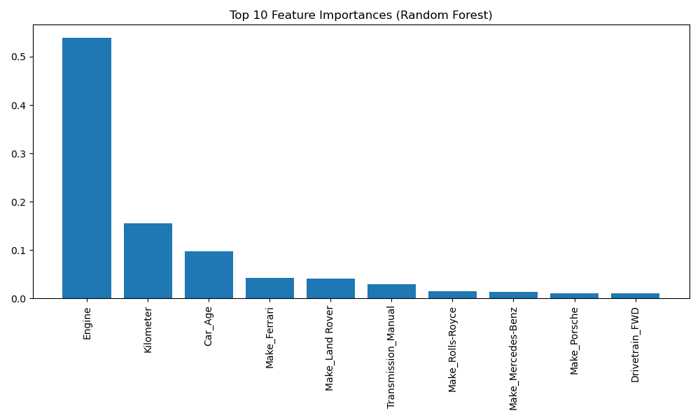
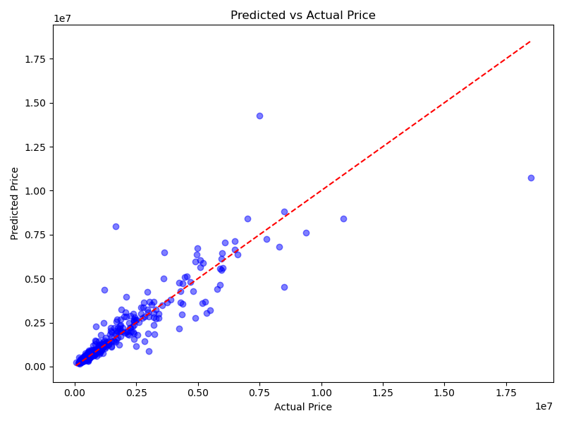

# 🚗 Used Car Price Prediction with Machine Learning.

This project predicts the **selling price of used cars** using real-world data and machine learning models such as **Linear Regression** and **Random Forest Regressor**. We focus on data cleaning, feature engineering, model training, hyperparameter tuning, and evaluation to build a reliable price prediction system.

---

## 📂 Dataset Overview

We used a dataset sourced from **CarDekho**, consisting of thousands of used car listings with details like:

| Column         | Description                             |
|----------------|-----------------------------------------|
| Make           | Car brand (e.g., Honda, Toyota)         |
| Model          | Specific model name                     |
| Price          | Selling price (target variable)         |
| Year           | Manufacturing year                      |
| Kilometer      | Distance driven                         |
| Fuel Type      | Petrol, Diesel, etc.                    |
| Transmission   | Manual or Automatic                     |
| Owner          | First, Second, etc.                     |
| Engine         | Engine capacity in cc                   |
| Drivetrain     | FWD, RWD, etc.                          |

---

## 🔧 Steps Performed

### 1. **Data Cleaning**
- Removed missing values
- Converted `Engine` from `'xxxx cc'` → numeric
- Standardized categorical data using one-hot encoding

### 2. **Feature Engineering**
- Created `Car_Age = 2025 - Year`
- Flagged high-mileage cars (`HighMileage`)
- Removed outliers in price using IQR method

### 3. **Modeling**
- Trained and evaluated:
  - Linear Regression
  - Random Forest Regressor
- Applied feature scaling (for Linear Regression)
- Tuned Random Forest using `GridSearchCV`

---

## 📊 Model Results

| Model              | RMSE (₹)     | R² Score |
|--------------------|-------------|----------|
| Linear Regression  | 11,98,583   | 0.62     |
| Random Forest      | **8,74,486**| **0.80** |

---

## 📈 Output Visualizations

### 🔹 Feature Importance (Top 10)


### 🔹 Predicted vs Actual Price


> You can generate and save these graphs from your notebook using `matplotlib.pyplot.savefig()`:
```python
plt.savefig('images/feature_importance.png')
```

---

## 🧠 Insights
- Engine size, Kilometer driven, Car Age, and Brand are strong predictors.
- Random Forest clearly outperforms linear models for this use case.
- Removing outliers improved performance significantly.

---

## 💾 Files in This Repository

| File                       | Description                                 |
|----------------------------|---------------------------------------------|
| `main.ipynb`               | Full notebook with code and outputs         |
| `used_car_rf_model.pkl`    | Final trained Random Forest model           |
| `data/`                    | Contains all versions of the dataset        |
| `README.md`                | This file                                   |

---

## 📦 Requirements

- Python 3.8+
- pandas
- numpy
- scikit-learn
- matplotlib
- seaborn

Install with:
```bash
pip install -r requirements.txt
```

---

## 👨‍💻 Author

**Meet Patel**  
*Master’s in Engineering & Management | Data Analytics Enthusiast*

---

## 🌟 Star the repo if you find it useful!
